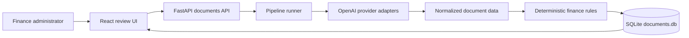

# Target architecture

Invoice Review is a small local full-stack application. OpenAI extracts evidence from one uploaded document. Deterministic Python applies Northstar policy. Maya keeps the final decision.

## Intended boundaries

- Provider adapters normalize OpenAI responses before data reaches the domain.
- Deterministic invoice and receipt rules remain separate from model extraction.
- Routes own HTTP concerns, a service owns orchestration, and a repository owns SQLite access.
- Environment values are read through one backend settings module and one frontend environment module.
- A person approves, rejects, or requests a supplier correction after seeing evidence and uncertainty.

## Target flow

## Extraction note

A `Pipeline` runner executes ordered steps against an immutable context: classify, extract, stamp field provenance, suggest GL, validate. Classification and extraction use OpenAI Responses API structured output. Human edits mark fields as `human` and outrank model confidence. Correction emails draft only for supplier-fixable issue codes. Deterministic Python validates GSTIN checksums, reconciles totals, and decides which issues block approval.
